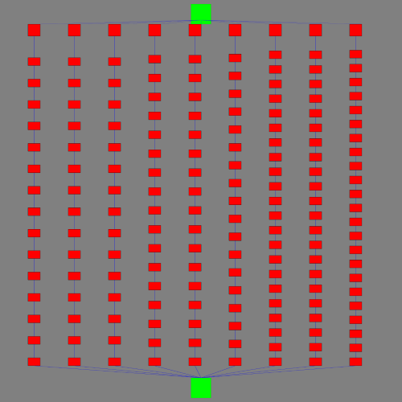

# map_image_lemin

This is a script to make an image of the paths that your lem-in uses, but with random coordinates. With 'big' and 'big-superposition' maps the image can be unclear.

## Prerequisites

Make sure you have installed python3 and Pillow

## Usage

1&nbsp;&nbsp;&nbsp;&nbsp;&nbsp;&nbsp;Run the following command:
```bash
$ pyhton3 make_img.py < [filename]
```
&nbsp;&nbsp;&nbsp;&nbsp;&nbsp;&nbsp;Where [filename] is a file that contains your lem-in output.

2&nbsp;&nbsp;&nbsp;&nbsp;&nbsp;&nbsp;It will print the paths your lem-in used, in the following format: "path[nbr] size is :[nbr2]" where nbr is the number of the path starting with &nbsp;&nbsp;&nbsp;&nbsp;&nbsp;&nbsp; 1 and nbr2 is how many rooms there are between the 'start' and 'end' room.

3&nbsp;&nbsp;&nbsp;&nbsp;&nbsp;&nbsp;The program will make an image and save it in the current folder as map.jpg.

4&nbsp;&nbsp;&nbsp;&nbsp;&nbsp;&nbsp;In the image the green squares are the 'start' and 'end' rooms and the red squares are the rooms in between.

## Example of the result


